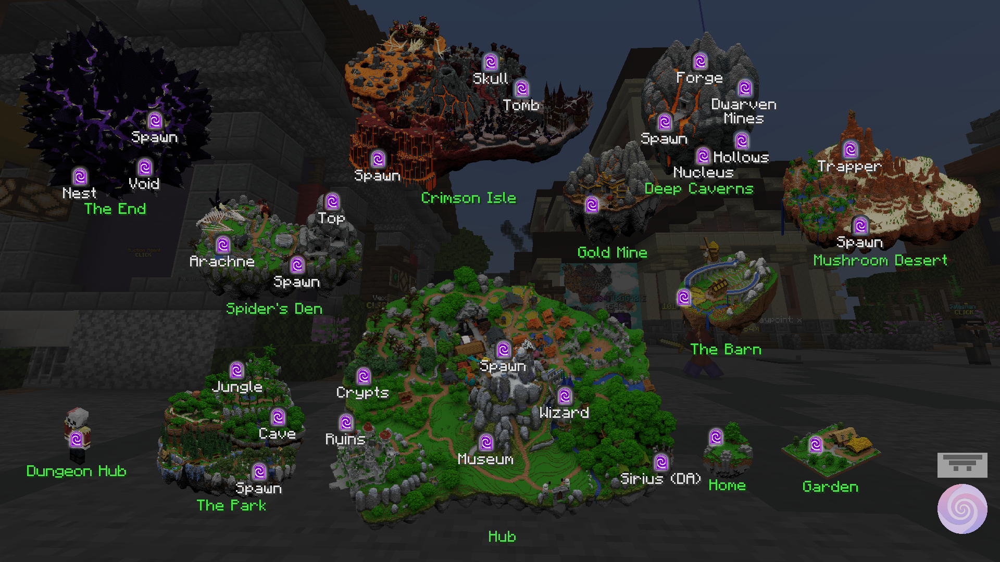
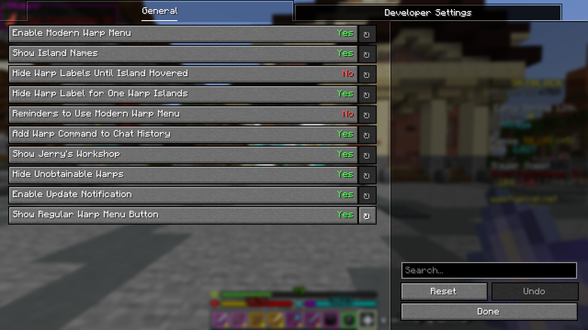

# Modern Warp Menu

This project is an Unofficial modern minecraft port of [Fancy Warp Menu](https://github.com/ILikePlayingGames/FancyWarpMenu)!

Supported version: 1.21.5

---

## Required mods

- [Fabric API](https://modrinth.com/mod/fabric-api)
- [YetAnotherConfigLib](https://modrinth.com/mod/yacl)

## Difference's from Original

- Custom Layout format
  - This means can't be use Fancy warp menu resource packs 
  - Diff previews are currently wip (Maybe I'll write in later)

## Screenshots

Warp Menu Screen

Settings